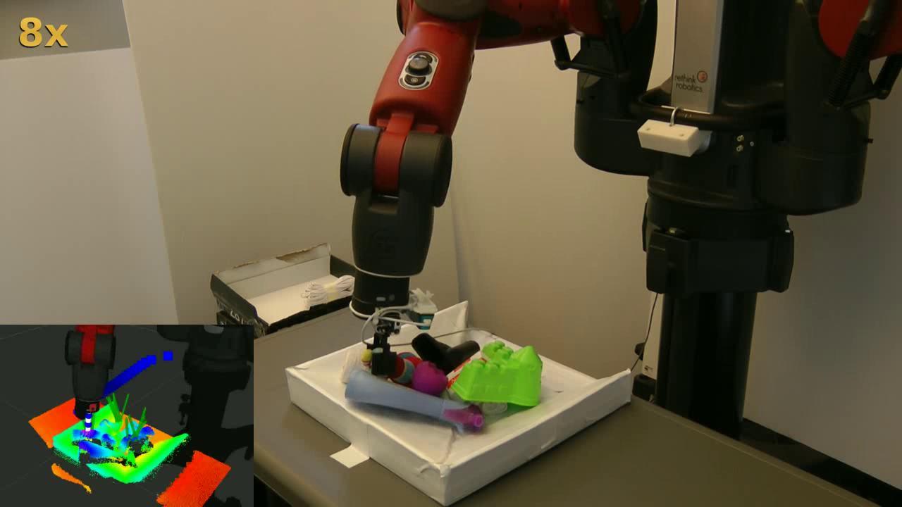
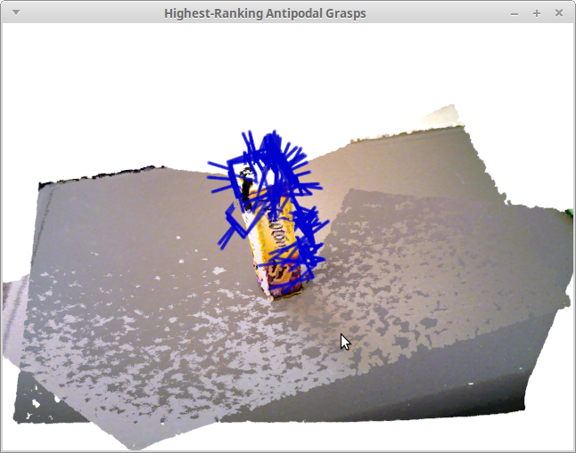

# agile_grasp 2.0

* **Author:** Andreas ten Pas (atp@ccs.neu.edu)
* **Version:** 1.0.0
* **ROS Wiki page:** not available yet
* **Author's website:** [http://www.ccs.neu.edu/home/atp/](http://www.ccs.neu.edu/home/atp/)


## 1) Overview

This package localizes antipodal grasps in 3D point clouds. AGILE stands for **A**ntipodal **G**rasp **I**dentification and 
**LE**arning. The reference for this package is: 
[High precision grasp pose detection in dense clutter](http://arxiv.org/abs/1603.01564). *agile_grasp 2.0* is an improved 
version of our previous package, [agile_grasp](http://wiki.ros.org/agile_grasp).

The package already comes with pre-trained machine learning classifiers and can be used (almost) out-of-the-box with 
RGBD cameras such as the Microsoft Kinect and the Asus Xtion Pro as well as point clouds stored as *.pcd files.


## 2) Requirements

1. [Lapack](http://www.netlib.org/lapack/) (install in Ubuntu: `$ sudo apt-get install liblapack-dev`) 
2. [OpenNI](http://wiki.ros.org/openni_launch) or a similar range sensor driver
3. [Caffe](http://caffe.berkeleyvision.org/) 


## 3) Installation

1. Install Caffe. [Instructions](https://github.com/BVLC/caffe/wiki/Install-Caffe-on-EC2-from-scratch-%28Ubuntu,-CUDA-7,-cuDNN%29) for Ubuntu 14.04. 
2. Compile Caffe as a cmake library ([https://github.com/BVLC/caffe/pull/1667](instructions)):

   ```
   $ cd caffe && mkdir cmake_build && cd cmake_build
   $ cmake .. -DBUILD_SHARED_LIB=ON
   $ make -j 12
   $ ln -s ../build .
   ```
   
   If the first line gives the error *Manually-specified variables were not used by the project: BUILD_SHARED_LIB*, 
   just run the first line again.
3. Clone the agile_grasp 2.0 repository into your ros workspace: 

   ```
   $ cd <location_of_your_ros_workspace>/src
   $ git clone https://github.com/atenpas/agile_grasp2
   ```
4. Recompile your ROS workspace: 

   ```
   $ cd ..
   $ catkin_make
   ```


## 4) Detect Grasp Poses With a Robot

1. Connect a range sensor, such as a Microsoft Kinect or Asus Xtion Pro, to your robot.
2. Adjust the file *robot_detect_grasps.launch* for your sensor and robot hand.
3. Run the grasp pose detection: 
   
   ```
   $ roslaunch agile_grasp2 robot_detect_grasps.launch
   ```





## 5) Detect Grasp Poses in a PCD File

1. Have a *.pcd file available. Let's say it's located at */home/user/cloud.pcd*. 
2. Change the parameter *cloud_file_name* in the file *file_detect_grasps.launch* to */home/user/cloud.pcd*.
3. Detect grasp poses: 
  
   ```
   roslaunch agile_grasp2 file_detect_grasps.launch
   ```



## 6) Citation

If you like this package and use it in your own work, please cite our [arXiv paper](http://arxiv.org/abs/1603.01564):

Marcus Gualtieri, Andreas ten Pas, Kate Saenko, and Robert Platt. **High precision grasp pose detection in dense 
clutter**. March 2016.  
